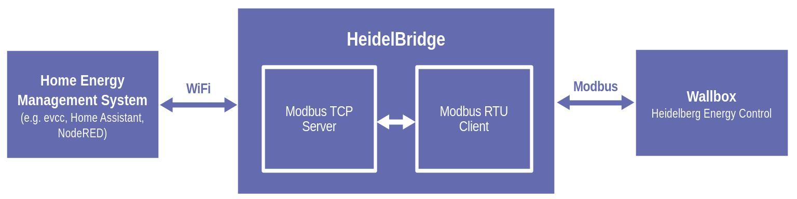

<div align="center">
  <a href="#">
    
 </a>
</div>
<h1 align="center">Heidel<span style="color:#646bafff">Bridge</span></h1>

HeidelBridge is a firmware for ESP32 microcontrollers. It allows you to bring your [Heidelberg wallbox](https://www.heidelberg-wallbox.eu) into your WiFi network. This is done by turning your wallbox into a [Daheimladen](https://www.daheimladen.de/) compatible device. This way the wallbox can easily be integrated into home energy management systems like [evcc](https://github.com/evcc-io/evcc) (no sponsor token required!).


  

---



---

# Required Hardware

You only need two components for this project: an ESP32 microcontroller and a MAX485 module. Both are available in large quantities and at reasonable prices on the Internet. You will also need a breadboard and a few jumper wires. All in all, it shouldn't cost you more than 10$.

Parts list:
- ESP32 microcontroller*
- MAX485 breakout board
- 6 jumper wires
- A breadboard

This should be enough for quickly putting together a fully functioning prototype.
Of course a well designed PCB would be much nicer, but this is still work in progress. Once the design is ready, the schematics will be available *right here*.

> *\* This project is currently based on the classic ESP32. It has not been built/tested for newer models, like the S2 and C6.*

---

# Setting Up The ESP32

## Programming your ESP32

- Start by cloning or downloading this repository.
- Change the SSID and password in `WifiConnection.cpp` to match your home network settings.
- Compile the project.
- Now connect your ESP32 via USB and upload the firmware.

---

# Hardware Installation

## Configuring The Heidelberg Wallbox

1. Disconnect the wallbox from the power supply.
2. Open the housing.
3. Set DIP switch S4 pin 4 to 1 (this sets the Modbus ID to 1).
4. Set DIP switch S6 pin 2 to 1 (this enables the 120 Ohm termination).

## Connecting the Hardware Components

The hardware connections are very simple:
- ESP32's GND to MAX485-board GND
- ESP32's 3.3 V to MAX485-board VCC
- ESP32 pin 18 to MAX485-board RO pin
- ESP32 pin 19 to MAX485-board DI pin
- ESP32 pin 21 to MAX485-board DE+RE pins
- MAX485-board A terminal to Heidelberg wallbox A terminal
- MAX485-board B terminal to Heidelberg wallbox B terminal


---

# Setting Up evcc

> [!IMPORTANT]
> Please make sure that you set up your HeidelBridge **before** adding it to evcc. Evcc won't start up, if it can't find your HeidelBridge! 

Adding your HeidelBridge to evcc is very straight forward.
Start by defining a new charger:

```
chargers:
  - name: heidelberg_ec
    type: template
    template: daheimladen-mb
    host: 192.168.178.133 # IP address or hostname
    port: 502 # Port (optional) 
```

Next, add a loadpoint:

```
loadpoints:
  - title: Heidelberg EC
    charger: heidelberg_ec
    mode: off
    guardduration: 5m
```

Aaaaaand you're done!
Start evcc with your new configuration and the HeidelBridge should be there.

---

# Contribution

:heart: Help is welcome! Do you own a Heidelberg Energy Control wallbox? Are you a Modbus expert? Do you have ideas for improvements? Did you find a bug? Feel free to review the code, create pull requests, open issues or contact me directly.

---

# Used Assets and Libraries

The following assets and libraries are used by this project:

- [Blueberry logo](https://www.vecteezy.com/free-vector/blueberry)
- [eModbus Arduino library](https://github.com/eModbus/eModbus)
- [Async TCP Arduino library](https://github.com/mathieucarbou/AsyncTCP)
- [ESP Async Webserver Arduino library](https://github.com/HenkHoldijk/mathieucarbou_ESPAsyncWebServer)
- [Websockets Arduino library](https://github.com/Links2004/arduinoWebSockets)
- [Daheimladen Modbus API](https://www.daheimladen.de/post/modbus-api)