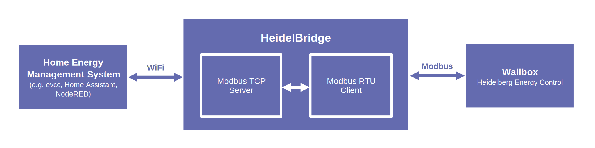

<div align="center">
  <a href="#">
    
 </a>
</div>
<h1 align="center">Heidel<span style="color:#646bafff">Bridge</span></h1>

HeidelBridge is a firmware for ESP32 microcontrollers. It allows you to bring your [Heidelberg wallbox](https://www.heidelberg-wallbox.eu) into your WiFi network. This is done by turning your wallbox into a [Daheimladen](https://www.daheimladen.de/) compatible device. This way the wallbox can easily be integrated into home energy management systems like [evcc](https://github.com/evcc-io/evcc).


---



---

# Roadmap

For the upcoming version **3.0** some nice enhancements are planned:
- :star: Pre-built binaries: no need to clone and compile the repositoiry yourself
- :star: OTA updates: simply update your HeidelBridge via WiFi
- :star: Wifi provisioning: easily integrate HeidelBridge into your home network

The new version is planned to be released in 2025. Stay tuned!

# Required Hardware

You only need two components for this project: an ESP32 microcontroller and a MAX485 module. Both are available in large quantities and at reasonable prices on the Internet. You will also need a breadboard and a few jumper wires. All in all, it shouldn't cost you more than 10$.

Parts list:
- ESP32 microcontroller*
- MAX485 breakout board
- 6 jumper wires
- A breadboard

This should be enough for quickly putting together a fully functioning prototype.
Of course a well designed PCB would be much nicer, but this is still work in progress. Once the design is ready, the schematics will be available *right here*.

> *\* This project is currently based on the classic ESP32. It has not been built/tested for newer models, like the S2 and C6.*

---

# Setting Up The ESP32

## Development Environment

To compile this project you will need to install VS Code and the PlatformIO extension. Both are available for free for Linux, MacOS and Windows.

## Programming your ESP32

- Start by cloning or downloading this repository.
- Change `board = ...` in platformio.ini to match the ESP32 board you are actually using.
- Copy the file `Credentials.cpp.template` to `Credentials.cpp`.
- Change the SSID and password in `Credentials.cpp` to match your home network settings.
- If you want to use MQTT, also insert your MQTT server's address and your user name / password (can be left empty if not required).
- Compile the project.
- Now connect your ESP32 via USB and upload the firmware.

---

# Hardware Installation

## Configuring The Heidelberg Wallbox

1. Disconnect the wallbox from the power supply.
2. Open the housing.
3. Set DIP switch S4 pin 4 to 1 (this sets the Modbus ID to 1).
4. Set DIP switch S6 pin 2 to 1 (this enables the 120 Ohm termination).

## Connecting the Hardware Components

The hardware connections are very simple:
- ESP32's GND to MAX485-board GND
- ESP32's 3.3 V to MAX485-board VCC
- ESP32 pin 18 to MAX485-board RO pin
- ESP32 pin 19 to MAX485-board DI pin
- ESP32 pin 21 to MAX485-board DE+RE pins
- MAX485-board A terminal to Heidelberg wallbox A terminal
- MAX485-board B terminal to Heidelberg wallbox B terminal


---

# Setting Up evcc

> [!IMPORTANT]
> Please make sure that you set up your HeidelBridge **before** adding it to evcc. Evcc won't start up, if it can't find your HeidelBridge! 

Adding your HeidelBridge to evcc is very straight forward.
Start by defining a new charger:

```
chargers:
  - name: heidelberg_ec
    type: template
    template: daheimladen-mb
    host: 192.168.178.133 # IP address or hostname
    port: 502 # Port (optional) 
```

Next, add a loadpoint:

```
loadpoints:
  - title: Heidelberg EC
    charger: heidelberg_ec
    mode: off
    guardduration: 5m
```

Aaaaaand you're done!
Start evcc with your new configuration and the HeidelBridge should be there.

---

# Setting up Home Assistant

HeidelBridge offers a simple MQTT API (see below). It also supports Home Assistant's MQTT auto discovery feature.
This way HeidelBridge can easily be added to Home Assistant:
 - Make sure the MQTT integration in Home Assistant is enabled.
 - Power on your HeidelBridge.
 - The HeidelBridge should immediately show up as an MQTT device.

GUI Example:


---

# MQTT API

The following topics are published by HeidelBridge:

| Topic                                     | Unit | Data Type | Description                                                             |
| ----------------------------------------- | ---- | --------- | ----------------------------------------------------------------------- |
| {DeviceName}/version                      | -    | String    | The version of the HeidelBridge firmware (e.g. 1.0.0).                  |
| {DeviceName}/build_date                   | -    | String    | Build date of the HeidelBridge firmware.                                |
| {DeviceName}/ip_address                   | -    | String    | Currently assigned IP address of the HeidelBridge.                      |
| {DeviceName}/is_vehicle_connected         | -    | Integer   | Boolean (0 or 1) indicating if a vehicle is connected.                  |
| {DeviceName}/is_vehicle_charging          | -    | Integer   | Boolean (0 or 1) indicating if a vehicle is charging.                   |
| {DeviceName}/vehicle_state                | -    | String    | 'disconnected', 'connected' or 'charging'.                              |
| {DeviceName}/charging_current_limit       | A    | Float     | Charging current limit in Ampere.                                       |
| {DeviceName}/charging_power               | W    | Float     | Momentary charging power in Watt.                                       |
| {DeviceName}/failsafe_current             | A    | Float     | Current the wallbox will fall back to in case of a communication error. |
| {DeviceName}/energy_meter                 | kWh  | Float     | Total charged energy so far.                                            |
| {DeviceName}/temperature                  | °C   | Float     | Current wallbox PCB temperature.                                        |
| {DeviceName}/charging_current/phase1      | A    | Float     | Momentary charging current on phase 1.                                  |
| {DeviceName}/charging_current/phase2      | A    | Float     | Momentary charging current on phase 2.                                  |
| {DeviceName}/charging_current/phase3      | A    | Float     | Momentary charging current on phase 3.                                  |
| {DeviceName}/charging_voltage/phase1      | V    | Float     | Momentary charging voltage on phase 1.                                  |
| {DeviceName}/charging_voltage/phase2      | V    | Float     | Momentary charging voltage on phase 2.                                  |
| {DeviceName}/charging_voltage/phase3      | V    | Float     | Momentary charging voltage on phase 3.                                  |
| {DeviceName}/internal/uptime              | s    | Integer   | Total time this HeidelBridge has been up and running.                   |
| {DeviceName}/internal/wifi_disconnects    | -    | Integer   | Total number of WiFi connection losses since start.                     |
| {DeviceName}/internal/mqtt_disconnects    | -    | Integer   | Total number of MQTT connection losses since start.                     |
| {DeviceName}/internal/modbus_read_errors  | -    | Integer   | Total number of Modbus RTU read errors since start.                     |
| {DeviceName}/internal/modbus_write_errors | -    | Integer   | Total number of Modbus RTU write errors since start.                    |

The following topics are subscribed by HeidelBridge. Use these to control your wallbox:

| Topic                                        | Unit | Data Type | Description                                                             |
| -------------------------------------------- | ---- | --------- | ----------------------------------------------------------------------- |
| {DeviceName}/control/charging_current_limit  | A    | Float     | Charging current limit in Ampere.                                       |

---

# Contribution

:heart: Help is welcome! Do you own a Heidelberg Energy Control wallbox? Are you a Modbus expert? Do you have ideas for improvements? Did you find a bug? Feel free to review the code, create pull requests, open issues or contact me directly.

---

# Used Assets and Libraries

The following assets and libraries are used by this project:

- [Blueberry logo](https://www.vecteezy.com/free-vector/blueberry)
- [eModbus Arduino library](https://github.com/eModbus/eModbus)
- [Async TCP Arduino library](https://github.com/mathieucarbou/AsyncTCP)
- [ESP Async Webserver Arduino library](https://github.com/HenkHoldijk/mathieucarbou_ESPAsyncWebServer)
- [Websockets Arduino library](https://github.com/Links2004/arduinoWebSockets)
- [Async MQTT Client](https://github.com/marvinroger/async-mqtt-client)
- [Daheimladen Modbus API](https://www.daheimladen.de/post/modbus-api)
