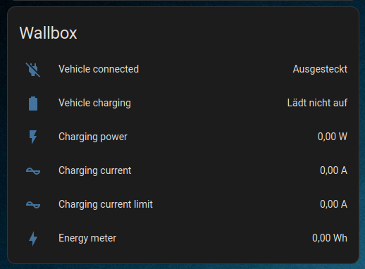

# Setting up Home Assistant

HeidelBridge offers a simple [MQTT API](APIReference.md). It also supports Home Assistant's MQTT auto discovery feature.
This way HeidelBridge can easily be added to Home Assistant:

- Make sure the MQTT integration in Home Assistant is enabled.
- Power on your HeidelBridge.
- The HeidelBridge should immediately show up as an MQTT device.

GUI Example (German):

## PV Surplus Charging Automation

HeidelBridge itself only exposes one control for charging: the current limit
(`number.<device>_control_charging_current_limit`). It accepts `0` A (charging
blocked) or `6.0`-`16.0` A (charging permitted). Deciding *how much* surplus
solar power is available and *which* charging strategy to use is not something
HeidelBridge does - that logic lives entirely in Home Assistant, as an
automation.

To get you started, a ready-made example automation is provided:
[`examples/ha-automation.yaml`](examples/ha-automation.yaml). It offers 5
selectable modes and requires no programming knowledge to set up - just follow
the steps below.

| Mode       | Effect                                                                            |
| ---------- | ---------------------------------------------------------------------------------- |
| Aus        | Charging is blocked (current limit set to 0 A).                                    |
| Manuell    | The automation does nothing; you control the current limit yourself (e.g. via a dashboard card). |
| Max        | Always charges at the maximum current (16 A).                                      |
| Nur PV     | Charges only from solar surplus; stops as soon as the available surplus drops below 6 A. |
| Min + PV   | Always charges with at least the minimum current (6 A), topped up with any available surplus. |

### 1. Prerequisites

- HeidelBridge is already visible in Home Assistant via MQTT discovery (see
  above).
- You have a sensor entity that reports your current **grid power in Watt**,
  using the sign convention: **positive = drawing power from the grid,
  negative = feeding surplus power into the grid**. This is how most smart
  meter/energy integrations report it (e.g. Tibber, SolarEdge, Shelly EM,
  smart meter integrations via a P1 reader, ...). If you are unsure, open
  *Developer tools > States*, search for your sensor, and watch its value
  while your solar system is producing more than the house consumes - it
  should go negative.

### 2. Create the mode selector helper

The automation is controlled through a dropdown helper.

1. Go to *Settings > Devices & Services > Helpers*.
2. Click *+ Create Helper* and choose *Dropdown*.
3. Set the name to exactly **Wallbox Modus** (this makes Home Assistant
   generate the entity ID `input_select.wallbox_modus`, which the example
   automation expects).
4. Add exactly these 5 options, spelled exactly like this (case and spaces
   matter):
   - `Aus`
   - `Manuell`
   - `Max`
   - `Nur PV`
   - `Min + PV`
5. Click *Create*.
6. Optional but recommended: add the new helper to one of your dashboards
   (e.g. as an *Entities* or *Dropdown* card) so you can switch modes easily.

### 3. Find your entity IDs

Before importing the automation, look up the exact entity IDs you'll need in
*Developer tools > States* (filter by your HeidelBridge device name, default
`heidelbridge`):

- `number.heidelbridge_control_charging_current_limit` - the charging current
  limit (created automatically by HeidelBridge).
- `sensor.heidelbridge_charging_power` - the wallbox's own charging power
  (created automatically by HeidelBridge).
- Your own grid power sensor from step 1.

If you changed the device name in the HeidelBridge web UI, the first two
entity IDs will use that name instead of `heidelbridge`.

### 4. Import the automation

1. Open [`examples/ha-automation.yaml`](examples/ha-automation.yaml) and copy
   its entire content.
2. In Home Assistant, go to *Settings > Automations & Scenes > Automations*.
3. Click *+ Create Automation*, then choose *Start with an empty automation*.
4. Click the three-dot menu in the top-right corner and select
   *Edit in YAML*.
5. Delete the placeholder content and paste the copied YAML instead.
6. Click *Save* (top-right).

### 5. Adjust the automation to match your setup

Still in the YAML editor, replace the two placeholder entity IDs with the
ones you found in step 3:

- Every occurrence of `sensor.smart_meter_ts_65a_3_real_power` → your own grid
  power sensor.
- If your device name isn't `heidelbridge`, every occurrence of
  `number.heidelbridge_control_charging_current_limit` and
  `sensor.heidelbridge_charging_power` → the entity IDs with your device name.

Save again once done.

### 6. Enable it

- Make sure the automation's toggle (top of the automation list, or the
  editor's header) is switched on.
- Set the `Wallbox Modus` helper to one of the 5 modes described in the table
  above to activate the corresponding charging strategy. Start with `Aus` or
  `Manuell` to verify everything reports correctly before trying `Nur PV` or
  `Min + PV`.

### 7. Troubleshooting

- The automation re-evaluates every minute, and immediately whenever the mode
  changes.
- If nothing seems to happen, open the automation, go to its *Traces* tab,
  and check which condition stopped execution.
- If your grid power or wallbox power sensor briefly shows "unavailable" or
  "unknown" (e.g. during a WiFi/MQTT reconnect), the automation intentionally
  skips that cycle instead of guessing with a wrong value - this is expected
  and resolves itself on the next run a minute later.
- See the [MQTT API reference](APIReference.md) for all available
  HeidelBridge topics and entities if you want to build your own automation
  instead.