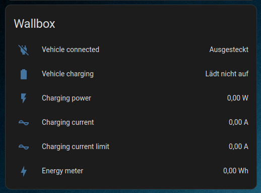

# Setting up Home Assistant

HeidelBridge offers a simple [MQTT API](APIReference.md). It also supports Home Assistant's MQTT auto discovery feature.
This way HeidelBridge can easily be added to Home Assistant:
 - Make sure the MQTT integration in Home Assistant is enabled.
 - Power on your HeidelBridge.
 - The HeidelBridge should immediately show up as an MQTT device.

GUI Example (German):

